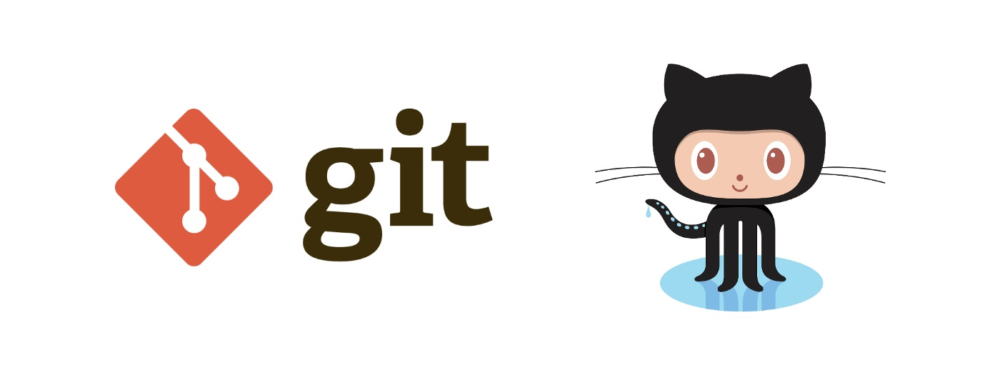

# GIT 
_**это распределенная система управления версиями.**_

## Основные команды Git
1. ### Git init - _инициализация локального репозитория_

2. ### Git status - _получить информацию от git о его текущем состоянии_

3. ### Git diff - _увидеть разницу между текущим файлом и закоммиченным файлом_

4. ### Git add - _добавить файл или файлы к следующему коммиту_

5. ### Git commit --m ""- _создать коммит, зафиксировать изменения_

6. ### Git log - _выводит список всех коммитов в хронологическом порядке_

7. ### Git checkout - _позволяет перемещаться между коммитами_

Предствленный список, это далеко не все команды Git.

Впереди ещё много всего нового и интересного!

[Прo __Git__ подробнее](https://git-scm.com/book/ru/v2/%D0%92%D0%B2%D0%B5%D0%B4%D0%B5%D0%BD%D0%B8%D0%B5-%D0%A7%D1%82%D0%BE-%D1%82%D0%B0%D0%BA%D0%BE%D0%B5-Git%3F)

## Работа с GitHub
1. Создать аккаунт на GitHub
2. Создать локальный репозиторий
3. Подружить локальный репозиторий с удалённым. GitHub подскажет как это можно сделать
4. Отправить (push) наш локальный репозиторий в удалённый на GitHub
5. При необходимости провести изменения "с другого компьютера"
6. Выкачать (pull) актуальное состояние из удалённого репозитория

> Все в этой стране должны учиться программировать, потому что это учит вас мыслить. __Стив Джобс__

